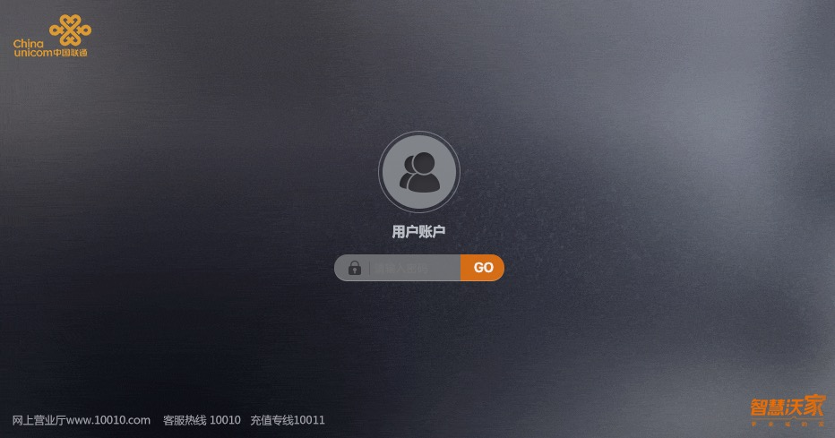

# Shell_Script 一些简单的脚本

- `installsoft_macos` 为macos 安装我需要的大部分软件

- `unicom_lightCat_restart.py` 通过命令行重启北京联通光猫，使用python3实现，调用了光猫的http接口。
    使用方式：`python3 unicom_lightCat_restart 'http://192.168.1.1' 'mima1'`
    
    
    